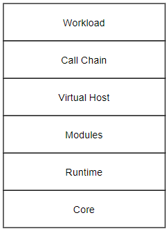
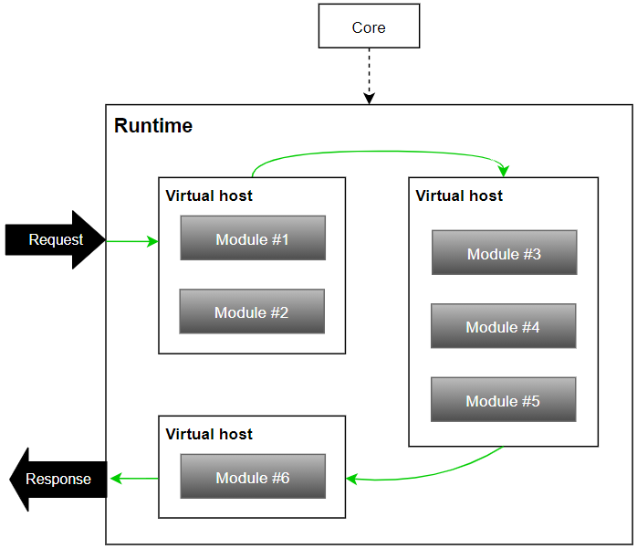

.. GENERATED by help2rst.py.  DO NOT EDIT DIRECTLY.

.. program:: nghttpx

Architecture
==========

Architecture
-----------------------

계층적 구조는 다음과 같다.

각 모듈별 역할과 책임은 다음과 같다.

*  ``Core`` - M2 라이프 사이클, 인터페이스 제공, 설정관리, 라이선스 관리
*  ``Runtime`` - 서비스 런타임, 컴포넌트 관리, 시스템 인터페이스
*  ``Components`` - HTTP, SSL/TLS, 캐시, 도큐먼트, 이미지, 비디오, 압축, 암호화 등등
*  ``Virtual Host`` - 가상호스트, 로그, 통계, 세션, 라우팅, 업/다운 스트림
*  ``Function Chain`` - 워크로드 라이브러리, 체이닝, 체인 컨테이너, 커스터마이징
*  ``Workload`` - On the fly 비지니스 로직

종속성과 동작 플로우는 다음과 같다.

3가지 선의 흐름이 존재한다.

*  ``RED`` 런타임 안에서 가상호스트끼리 유연한 서비스 체인을 구성한다.
*  ``GREEN`` 워크로드/비지니스 로직 구현을 위해 함수체인을 자유롭게 구성한다.
*  ``BLUE`` 가상호스트와 함수는 런타임을 이용해 모든 컨포넌트를 제약없이 사용한다.

이 중 함수 체인은 표준 IN/OUT 인터페이스를 이용해 자유로운 조합이 가능하다. 
다음은 조건 분기를 체인에 구성하여 A/B 테스트를 구성하는 예시이다.

컴포넌트
-----------------------

가상호스트 체인
-----------------------

함수 체인
-----------------------