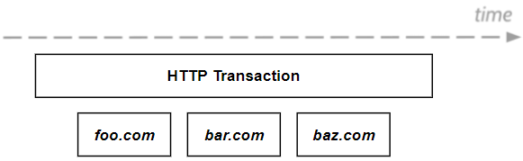
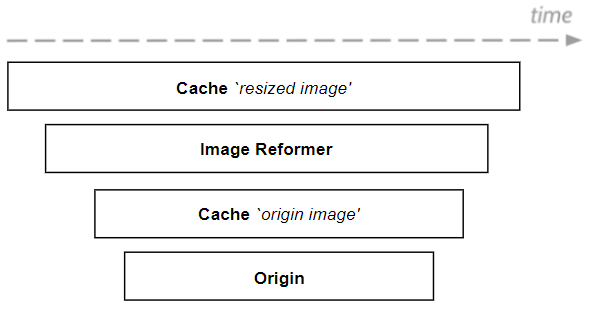

.. program:: nghttpx

Architecture
==========

``M2`` 아키텍쳐 컨셉은 확장성 있는 마이크로 서비스와 손쉬운 통합이다.

구조
-----------------------

구조는 다음과 같다.

.. figure:: img/0001.png
   :align: center

각 구성요소의 역할과 책임은 다음과 같다.

*  ``Core`` - M2 라이프 사이클, RESTful API, 설정관리, 라이선스
*  ``Runtime`` - 서비스 런타임, 가상호스트 관리, 전역자원, 시스템 추상화
*  ``Virtual Host`` - 가상호스트, 로그, 통계, 세션, 라우팅, 업/다운 스트림
*  ``Call Chain`` - 모듈과 함수 구성, 객체 라이프사이클, 파이프라인, 외부통신, 분기, 트레이스
*  ``Workload`` - 비지니스 로직, 콘텐츠 생산

준비된 모듈과 함수를 ``Call Chain`` 으로 구성하여 Workload를 처리한다. (아래 그림의 녹색)

.. figure:: img/0002.png
   :align: center

하나의 Workload를 처리하기 위해 연결된 흐름을 콜체인 ``Call Chain`` 이라고 부른다.

``Call Chain``
-----------------------

``Call Chain`` 은 `Open Tracing <https://opentracing.io/>`_ 의 SPANS 와 TRACE 개념에 기반한다.

HTTP Transaction은 ``Runtime`` 에 의해 여러 가상호스트를 연결하여 처리된다.

가상호스트 단위에서 모듈과 함수를 각각 연결하여 비지니스 로직의 구현이 가능하다.
"임의의 외부 이미지를 다운로드/RESIZE 한 뒤 캐싱 서비스한다." 라면 다음과 같은 모듈 체인이 구성된다.

보다 복잡하고 정교한 비지니스 로직을 구현하려면 더 작은 단위의 함수 체인를 구성할 수 있다.

   .. figure:: img/0006.png
      :align: center

가상호스트 체인
-----------------------

함수 체인
-----------------------