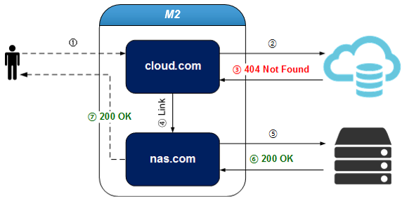
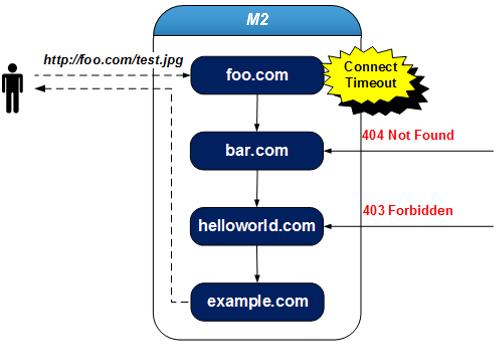
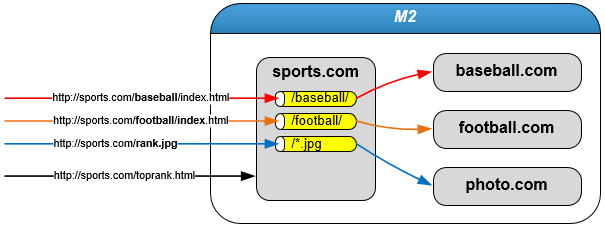

.. _engine-caching:

8장. 캐싱 엔진
******************

``M2`` 는 캐싱엔진으로 `STON Edge Server <https://ston.readthedocs.io/>`_ 를 탑재한다.
`STON Edge Server <https://ston.readthedocs.io/>`_ 의 강력한 캐싱 기능과 더불어 다양한 `Contents Service Patterns <https://csp-kr.readthedocs.io/>`_ 구현을 위한 확장기능을 제공한다.

.. toctree::
   :maxdepth: 2

.. _engine-caching-transparency:

위치 투명성
====================================

`인프라 구성 패턴 <https://csp-kr.readthedocs.io/ko/latest/patterns/pattern_infra.html>`_ 의 핵심은 위치 투명성이다. 
확장된 기능을 통해 중단없는 마이그레이션이 가능하다.

.. _engine-caching-vhost-link:

가상호스트 링크
-------------------------------------------

콘텐츠가 여러 원본에 분산되어 있다면, 가상호스트 링크를 활용하여 콘텐츠가 통합되어 있는 것처럼 서비스가 가능하다.

.. note::

   - 이 기능을 활용하면 `인프라 구성 패턴 <https://csp-kr.readthedocs.io/ko/latest/patterns/pattern_infra.html>`_ 의 위치 투명성을 손쉽게 구현할 수 있다.

특히 On-Premise에서 클라우드로 스토리지를 마이그레이션하거나, 스토리지의 용량, 비용 등의 이유로 콘텐츠가 분산되어 있는 환경에서 유용하다.

   cloud.com에 없는 콘텐츠는 nas.com이 처리한다.

::

   # vhosts.xml - <Vhosts><Vhost>

   <VhostLink Condition="...">...</VhostLink>

-  ``<VhostLink>`` 요청을 위임할 가상호스트 이름. 콘텐츠에 대한 원본 응답이 ``Condition`` 을 만족하면 지정된 가상호스트로 요청을 위임한다. 단 하나만 설정할 수 있다.

   - ``Condition`` HTTP 응답코드/패턴(1xx, 2xx, 3xx, 4xx, 5xx), fail(원본에서 캐싱하지 못한 경우)

클라이언트 요청이 다른 가상호스트로 위임되더라도 :ref:`monitoring_stats_vhost_client` 와 :ref:`admin-log-access` 는 클라이언트가 접근한 가상호스트에 기록된다.

.. note::

   링크 관계에 있는 가상호스트 설정이 다를 경우 의도치 않게 동작할 수 있음을 주의한다.
   가상호스트 링크가 A(단순 캐싱) -> B(이미지 압축)로 맺어져 있다면,
   A에서 처리된 이미지는 압축되지 않지만 B에서 처리된 이미지는 압축된다.

예를 들어 nas.com의 콘텐츠를 cloud.com으로 이전 중일 경우, cloud.com에 없는(=404 Not Found) 콘텐츠에 대해서만 nas.com으로 요청을 보낼 수 있다.
아래의 경우 요청이 nas.com에 의해 처리되더라도 :ref:`monitoring_stats_vhost_client` 와 :ref:`admin-log-access` 는 cloud.com에 기록된다.

::

   # vhosts.xml - <Vhosts>

   // cloud.com에 없는(=404 Not Found) 콘텐츠는 nas.com에서 서비스한다.
   <Vhost Name="cloud.com">
     <VhostLink Condition="404">nas.com</VhostLink>
   </Vhost>

   <Vhost Name="nas.com">
   </Vhost>

:ref:`admin-log-access` 의 vhostlink 필드를 통해 클라이언트 요청이 어느 가상호스트에서 처리되었는지 알 수 있다.
"-" 는 요청이 링크되지 않았음을 의미하며 "nas.com" 은 해당 요청이 링크되어 nas.com에서 처리되었음을 의미한다. ::

    #Fields: date time s-ip cs-method cs-uri-stem ...(중략)... vhostlink
    2016.11.24 16:52:24 220.134.10.5 GET /web/h.gif ...(중략)... -
    2016.11.24 16:52:26 220.134.10.5 GET /favicon.ico ...(중략)... nas.com

링크가 여러 번 발생했다면 "+"를 구분자로 링크된 모든 가상호스트가 명시된다.
이 경우 가장 마지막에 위치한 가상호스트가 최종 요청을 처리한 가상호스트이다.

다음과 같이 여러 가상호스트를 다른 조건으로 링크할 수 있다.

::

   # vhosts.xml - <Vhosts>

   // 원본서버가 5xx로 응답했거나 캐싱하지 못했을 때(=fail) 해당 요청을 bar.com에게 위임한다.
   <Vhost Name="foo.com">
     <VhostLink Condition="5xx,fail">bar.com</VhostLink>
   </Vhost>

   // 원본서버가 4xx로 응답했을 때 해당 요청을 helloworld.com에게 위임한다.
   <Vhost Name="bar.com">
     <VhostLink Condition="4xx">helloworld.com</VhostLink>
   </Vhost>

   // 원본서버에서 403, 404 또는 5xx로 응답했을 때 해당 요청을 example.com에게 위임한다.
   <Vhost Name="helloworld.com">
     <VhostLink Condition="403,404,5xx">example.com</VhostLink>
   </Vhost>

   // 더 이상 위임하지 않는다.
   <Vhost Name="example.com">
   </Vhost>

   억지스럽지만 가능하다.

위 예제의 경우 foo.com의 :ref:`admin-log-access` 는 다음과 같다. ::

   #Fields: date time s-ip cs-method cs-uri-stem ...(중략)... vhostlink
   2016.11.24 16:52:24 220.134.10.5 GET /test.jpg ...(중략)... bar.com+helloworld.com+example.com

다음의 경우 링크는 즉시 중단된다.

* 대상 가상호스트가 존재하지 않는 경우 (foo.com -> ?)
* 자기 자신을 대상 가상호스트로 지정한 경우 (foo.com -> foo.com)
* 재귀링크(Recursive Link)가 발생한 경우 (foo.com -> bar.com -> foo.com)

.. _engine-caching-vhost-redirection-trace:

Redirect 추적
-------------------------------------------

원본서버에서 Redirect계열(301, 302, 303, 307)로 응답하는 경우 ``Location`` 헤더를 추적하여 콘텐츠를 요청한다.

   .. figure:: img/conf_redirectiontrace.png
      :align: center

      클라이언트는 Redirect여부를 모른다.

::

   # server.xml - <Server><VHostDefault><OriginOptions>
   # vhosts.xml - <Vhosts><Vhost><OriginOptions>

   <RedirectionTrace>OFF</RedirectionTrace>

-  ``<RedirectionTrace>``

   - ``OFF (기본)`` 3xx 응답으로 저장된다.

   - ``ON`` Location헤더에 명시된 주소에서 콘텐츠를 다운로드 한다.
     형식에 맞지 않거나 Location헤더가 없는 경우에는 동작하지 않는다.
     무한히 Redirect되는 경우를 방지하기 위하여 1회만 추적한다.

특정 URL 패턴에 대해서만 동작시킬 수 있다. ::

   # server.xml - <Server><VHostDefault><OriginOptions>
   # vhosts.xml - <Vhosts><Vhost><OriginOptions>

   <RedirectionTrace ResCode="302,307">ON
      <URL>*.ts</URL>
      <URL>*.mp4</URL>
   </RedirectionTrace>

``<RedirectionTrace>`` 하위에 ``<URL>`` 들을 열거하면 ``Location`` 헤더 값의 특정 패턴에 대해서만 추적한다.

.. _engine-caching-vhost-sub-path:

Sub-Path 지정
-------------------------------------------

한 가상호스트에서 경로에 따라 다른 가상호스트가 처리하도록 설정할 수 있다.

   통계/로그는 요청을 최종처리한 각각의 가상호스트에 기록된다.

::

   # vhosts.xml - <Vhosts>

   <Vhost Name="sports.com">
     
       <Path Vhost="baseball.com">/baseball/<Path>
       <Path Vhost="football.com">/football/<Path>
       <Path Vhost="photo.com">/*.jpg<Path>
     
   </Vhost>

   <Vhost Name="baseball.com" />
   <Vhost Name="football.com" />
   <Vhost Name="photo.com" />

-  ```` 경로나 패턴이 일치하면 해당 요청을 다른 가상호스트로 보낸다.
   일치하지 않는 경우만 현재 가상호스트가 처리한다.

   - ``Status (기본: Active)`` Inactive인 경우 무시한다.

   -  ``<Path>`` 클라이언트가 요청한 URI와 경로가 일치하면 ``Vhost`` 로 해당 요청을 보낸다.
      값은 경로 또는 패턴만 가능하다. ::

         <Path Vhost="baseball.com">baseball<Path>
         <Path Vhost="photo.com">*.jpg<Path>

      위와 같이 입력해도 각각 /baseball/과 /*.jpg로 인식된다.

예를 들어 클라이언트가 다음과 같이 요청했다면 해당 요청은 가상호스트 football.com이 처리한다. ::

   GET /football/rank.html HTTP/1.1
   Host: sports.com

