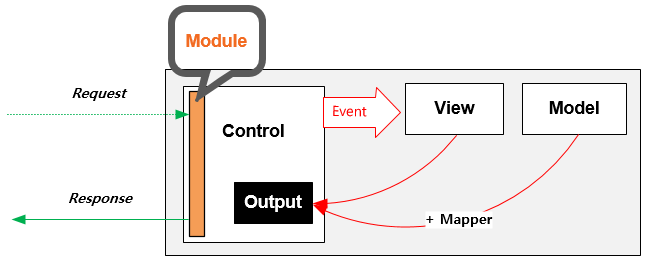

.. _endpoint:

4장. Endpoint
******************

이 장에서는 M2의 동작 단위인 엔드포인트(Endpoint)에 대해 설명한다.
엔드포인트는 멀티구성이 가능하다. 
다음과 같이 MVC(Model-View-Control) 구조로 동작한다.

.. figure:: img/m2_13.png
    :align: center

.. _endpoint-ston-conf:

가상호스트 설정
====================================

M2는 `STON 가상호스트 <https://ston.readthedocs.io/ko/latest/admin/environment.html#vhosts-xml>`_ 의 원본서버로 동작한다. 
다음과 같이 가상호스트를 생성한다. ::

   # vhosts.xml

   <Vhosts>
      <Vhost Name="www.example.com">

         <!-- [M2] Loopback:8585포트 사용 -->
         <Origin>
            <Address>127.0.0.1:8585</Address>
         </Origin>
         <Options>
            <BypassPostRequest Sticky="OFF">ON</BypassPostRequest>
            <BypassGetRequest Sticky="OFF">ON</BypassGetRequest>
            <BypassPutRequest Sticky="OFF">ON</BypassPutRequest>
         </Options>

         <!-- [M2] 배제금지 -->
         <OriginOptions>
            <Exclusion>0</Exclusion>
         </OriginOptions>

         <!-- [M2] 설정 -->
         <M2 Status="Active">
            ... (생략) ...
         </M2>
         
      </Vhost>
   </Vhosts>

주요 설정은 다음과 같다.

-  ``<Bypass***Request>`` 모두 ``ON`` 인 이유는 캐싱을 하지 않겠다는 의미이다.
   캐싱설정을 구성하면 ``TCP_MISS`` 계열의 요청만 M2로 보내진다.

-  ``<Exclusion>`` M2 엔진을 배제시키지 않는다.

그 밖에 :ref:`op-log-analyze-debug-header` 와 로그 확장을 위해 다음 설정을 추가한다. ::

   # vhosts.xml - <Vhosts><Vhost>

   <Options>
      <OriginalHeader>ON</OriginalHeader>
      <ModifyHeader FirstOnly="OFF">ON</ModifyHeader>
   </Options>
   <Log>
      <Origin ExtraField="x-m2-tid" Local="ON"/>
   </Log>

::

   # /svc/www.example.com/headers.txt

   $URL[*], $RES[x-ston-sessionid:#SESSIONID], Set,

-  ``<OriginalHeader>`` M2가 응답하는 비표준 헤더( ``x-m2-tid`` , ``x-m2-error-url`` )를 캐싱엔진이 누락시키지 않는다.

-  ``<ModifyHeader>`` 세션 ID를 클라이언트에게 리턴한다.

-  ``<Log><Origin>`` 디버깅 로그 강화

엔드포인트 설정
====================================

엔드포인트는 ``<M2>`` 하위에 설정한다. ::

   # vhosts.xml - <Vhosts>

   <Vhost Name="www.example.com">
      ... (생략) ...
      <M2 Status="Active">
         <Endpoints>
            
            <Endpoint Alias="inven">
               <Model> ... </Model>
               <View> ... </View>
               <Control> ... </Control>            
            </Endpoint>

            <Endpoint Alias="platinum_user">
               <Model> ... </Model>
               <Control> ... </Control>            
               <View> ... </View>
            </Endpoint>

         </Endpoints>
      </M2>
   </Vhost>

``<M2>`` 태그의 ``Status`` 속성이 ``Active`` 일 때 활성화된다. 
각 ``<Endpoint>`` 하위에 MVC 설정를 구성한다.

-  ``<Model>`` - 엔드포인트가 참조하는 데이터 구성
-  ``<View>`` - 엔드포인트의 출력물 구성
-  ``<Control>`` - 엔드포인트 호출 인터페이스 설정

Control
====================================

클라이언트는 ``<Control>`` 주소을 통해 HTTP 인터페이스를 구성한다. ::

   # vhosts.xml - <Vhosts><Vhost><M2><Endpoints><Endpoint>

   <Control>
       <Path ModelParam="model" ViewParam="view" Post="off" Get="on">/banner</Path>
   </Control>
   

-  ``<Path>`` 엔드포인트를 게시(Publish)할 Path를 설정한다. 

   -  ``ModelParam (기본: "model")`` 모델 참조시 사용된 ``#model`` 값
   -  ``ViewParam (기본: "view")`` 뷰 참조시 사용된 ``#view`` 값
   -  ``Post (기본: OFF)`` `POST Method`_ 허용 여부
   -  ``Get (기본: ON)`` `GET Method`_ 허용 여부

GET Method
------------------------------------

결합할 모델(=정보)과 뷰(=표현)를 QueryString으로 입력한다. ::

   GET /myendpoint?model=wine&view=soft

.. _endpoint-post-method:

POST Method
------------------------------------

POST 메소드는 개발 및 테스트 용도로 지원된다. 
``<Path Post="off" ...>`` 인 경우 ``403 Forbidden`` 으로 응답한다.

Body와 QueryString을 혼합해 사용 가능하다. ::

   # GET 방식과 동일
   POST /myendpoint?model=wine&view=catalog
   
   { }

::

   # Model과 View 업로드

   POST /myendpoint

   {
        "model" : { ... },
        "view" : "<html>...</hmtl>"
   }

::

   # View만 업로드

   POST /myendpoint?model=wine

   {
       "view" : "<html>...</hmtl>"
   }

::

   # Model만 업로드
   POST /myendpoint?view=catalog

   {
       "model" : { }
   }

.. _endpoint-control-module:

확장모듈
------------------------------------

확장모듈은 기존 시스템과 연동을 위한 목적으로 사용된다.

-  이미 사용하는 Web API 규격이 있는 경우
-  인증, 모니터링 등 기존 시스템과 연계하는 경우
-  생성된 콘텐츠 S3나 NAS등으로 백업하는 경우

::

   # vhosts.xml - <Vhosts><Vhost><M2><Endpoints><Endpoint>

   <Control>
       <Module Name="aws_s3-backup">bucket:mybucket; object:/my/desired/key.txt;</Module>
   </Control>
   

-  ``<Module>`` 약속된 연동모듈을 ``Name`` 속성으로 로딩한다. 모듈의 파라미터는 값으로 전달한다.

.. _endpoint-control-error:

커스텀 에러
====================================

네트워크 장애 등의 이유로 엔드포인트가 실패하면 디버깅 정보가 제공된다. 
디버깅 정보가 아닌 좀 더 우아한 에러처리가 필요할 경우 커스텀 에러를 설정한다. ::

   # vhosts.xml - <Vhosts><Vhost><M2><Endpoints>

   <Endpoint>
      <Model> ... </Model>
      <Control> ... </Control>
      <View> ... </View>
      <Error ResCode="200" ContentType="image/gif">http://foo.com/default/error.gif</Error>
   </Endpoint>
   

위와 같이 설정하면 엔드포인트가 정상적으로 콘텐츠를 생성하지 못할 때 ``http://foo.com/default/error.gif`` 콘텐츠가 ``200 OK`` 응답코드로 전송된다.

-  ``ResCode (기본: 0)`` 응답코드를 설정한다. 
   ``0`` 으로 설정한 경우 URL의 응답코드로 설정된다.
-  ``ContentType`` 의 우선순위는 아래와 같다.
   
   1.  ``ContentType`` 속성 값
   2.  `확장자 MimeType <https://svn.apache.org/repos/asf/httpd/httpd/trunk/docs/conf/mime.types>`_
   3.  ``text/plain``

.. _endpoint-default:

Default 엔드포인트
====================================

요청을 처리할 엔드포인트를 찾지 못한 경우 선택될 엔드포인트를 지정한다. 
설정하지 않는다면 ``404 Not Found`` 로 응답한다. ::

   # vhosts.xml - <Vhosts><Vhost><M2>

   <Endpoints>
      <Endpoint> ... </Endpoint>
      <Endpoint> ... </Endpoint>
      <Endpoint> ... </Endpoint>
      
      <Default>/myendpoint</Default>
   </Endpoints>

-  ``<Default>`` 엔드포인트의 ``<Path>``

``<Default>`` 로 지정된 엔드포인트의 `확장모듈`_ 을 이용해 다양한 기능을 손쉽게 구현할 수 있다.

-  기존 URL규칙에 대한 정교한 엔드포인트 분기
-  HTTP 요청 조작
-  통계수집
-  인증
