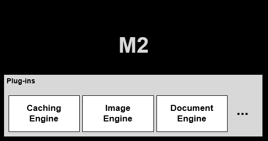

.. _getting-started:

3장. 시작하기
******************

이 장에서는 M2 설정구조를 설명한다. 
M2는 플러그인 아키텍처로 각 모듈은 독립적으로 확장/교체 가능하다.

.. note::

   M2는 런타임(Runtime) 엔진으로 `STON <https://ston.readthedocs.io/ko/latest/>`_ 을 사용한다. 
   따라서 이미 검증된 `STON <https://ston.readthedocs.io/ko/latest/>`_  기능들(설정, 로그, 통계, 모니터링 등)을 그대로 사용할 수 있다.

.. toctree::
   :maxdepth: 2

.. _getting-started-command:

서비스 명령어
====================================

M2는 리눅스 서비스로 동작한다. 
제어 명령어는 다음과 같다. ::

   service m2 start
   service m2 stop
   service m2 restart
   service m2 status

.. _getting-started-command-saferestart:

무중단 재시작
-----------------------------------------------

서비스 중단없이 CPU 코어 단위로 서비스 데몬을 순차적으로 재기동한다. ::

   service m2 saferestart

30초마다 2개의 코어를 재시작한다.
8코어로 구동되고 있다면 총 2분에 걸쳐 재가동이 진행된다.

.. _getting-started-sysconf:

시스템 구성
====================================

================= =================== ===========================
항목               권장                최소
================= =================== ===========================
OS                 Cent 7.6 이상       Cent 7.4 이상
CPU                8                   4
Memory             32                  16
Disk               100GB               100GB
NIC                1GbE 이상           1GbE 이상
================= =================== ===========================

.. note::

   100GB 디스크는 로그 저장용이다. 
   콘텐츠 캐싱이 필요한 경우 `캐싱 디스크 <https://ston.readthedocs.io/ko/latest/admin/environment.html#storage>`_ 를 별도로 구성한다.

.. _getting-started-os:

OS 구성
====================================

Cent OS 7.4이상만 지원한다.

.. _getting-started-install:

설치
====================================

1. 의존성 패키지를 설치한다. 쉘에서 다음 라인을 복사하여 실행한다. ::

      [root@localhost ~]# yum -y install pango libXcomposite libXcursor libXdamage libXext libXi libXtst cups-libs libXScrnSaver libXrandr GConf2 alsa-lib atk gtk3 ipa-gothic-fonts xorg-x11-fonts-100dpi xorg-x11-fonts-75dpi xorg-x11-utils xorg-x11-fonts-cyrillic xorg-x11-fonts-Type1 xorg-x11-fonts-misc fontconfig unzip ImageMagick

2. M2 패키지를 다운로드 한다. ::

      [root@localhost ~]# wget http://m2.winesoft.co.kr/m2-20.06.0.rhel.2.6.32.x64.tar.gz

3. M2 패키지의 압축을 해지한다. ::

		[root@localhost ~]# tar -zxf m2-20.06.0.rhel.2.6.32.x64.tar.gz

4. M2 설치 스크립트를 실행한다.  ::

      [root@localhost ~]# ./install_m2.sh
      Installing M2  20.06.0
      
      ... (생략) ...      

      Installation M2 Successfully
      Usage) service ston start|stop|restart|status

5. M2 서비스 데몬의 정상기동을 확인한다.  ::

      [root@localhost ~]# service ston status

      stond Running
      ┌─────┬───────┬─────────────┬─────────┬─────────┬──────────┬────────┬──────┬───────────┬──────────┬──────────┬──────────┬──────────┐
      │ id  │ name  │ namespace   │ version │ mode    │ pid      │ uptime │ ↺    │ status    │ cpu      │ mem      │ user     │ watching │
      ├─────┼───────┼─────────────┼─────────┼─────────┼──────────┼────────┼──────┼───────────┼──────────┼──────────┼──────────┼──────────┤
      │ 0   │ m2    │ default     │ 20.06.0 │ cluster │ 3336     │ 19h    │ 0    │ online    │ 0.4%     │ 98.6mb   │ root     │ disabled │
      │ 1   │ m2    │ default     │ 20.06.0 │ cluster │ 3343     │ 19h    │ 0    │ online    │ 0.4%     │ 107.1mb  │ root     │ disabled │
      │ 2   │ m2    │ default     │ 20.06.0 │ cluster │ 3404     │ 19h    │ 0    │ online    │ 0.2%     │ 109.0mb  │ root     │ disabled │
      │ 3   │ m2    │ default     │ 20.06.0 │ cluster │ 3410     │ 19h    │ 0    │ online    │ 0.2%     │ 96.4mb   │ root     │ disabled │
      └─────┴───────┴─────────────┴─────────┴─────────┴──────────┴────────┴──────┴───────────┴──────────┴──────────┴──────────┴──────────┘

.. _getting-started-license:

라이선스 발급
====================================

신규 고객은 다음 절차를 통해 라이선스를 발급한다.

* `신청양식 <http://www.winesoft.co.kr/lic_req.doc>`_ 작성
* license@winesoft.co.kr 로 전송
* 확인절차 후 발급

라이선스 파일(license.xml)이 반드시 ``/usr/local/ston/`` 에 존재해야 정상적으로 구동된다.

.. _getting-started-update:

업데이트
====================================
최신버전이 배포되면 다시 설치한다.

.. _getting-started-samplevhost:

Hello World
====================================
vhosts.xml 파일을 설정한다. ::

    <Vhosts>
        <Vhost Name="www.example.com">
            <Origin>
                <Address>127.0.0.1:8585</Address>
            </Origin>
            <M2 Status="Active">
                <Endpoints>
                    <Endpoint>
                        <Control>
                           <Path>/banner</Path>
                        </Control>
                        <Model>
                           <Source>http://demo.winesoft.co.kr/m2/models/#model.json</Source>
                        </Model>
                        <View>
                           <Source>http://demo.winesoft.co.kr/m2/views/#view.html</Source>
                        </View>
                    </Endpoint>
                </Endpoints>
            </M2>
        </Vhost>
    </Vhosts>

설정을 반영한다.

::

   [root@localhost ~]# /usr/local/ston/stonapi conf/reload

.. _getting-started-runcheck:

가상호스트 동작확인
-----------------------------------------------

(Windows 10 기준) C:\\Windows\\System32\\drivers\\etc\\hosts 파일에 www.example.com 도메인을 설정한다. ::

    192.168.0.100        www.example.com

브라우저로 다음주소에 접근했을 때 아래 이미지가 정상적으로 서비스되면 성공이다. ::

   http://www.example.com/banner?model=sale&view=sample1

::

   http://www.example.com/banner?model=sale&view=sample2

::

   http://www.example.com/banner?model=sale&view=sample3

이상의 이미지들은 다음 URL들을 M2가 조합한 결과다. ::

   // 모델 - 상품정보
   http://demo.winesoft.co.kr/m2/models/sale.json

   // 뷰 - 이미지 템플릿
   http://demo.winesoft.co.kr/m2/views/sample1.html
   http://demo.winesoft.co.kr/m2/views/sample2.html
   http://demo.winesoft.co.kr/m2/views/sample3.html

설정구조
====================================

`STON Edge Server <https://ston.readthedocs.io/ko/latest/admin/environment.html>`_ 와 동일하다.

