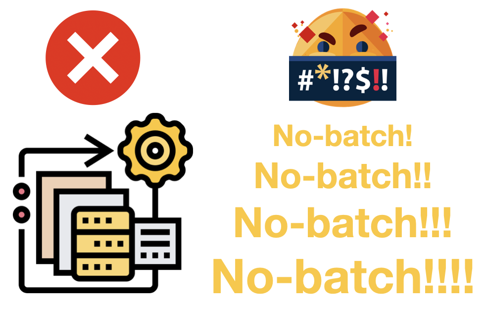
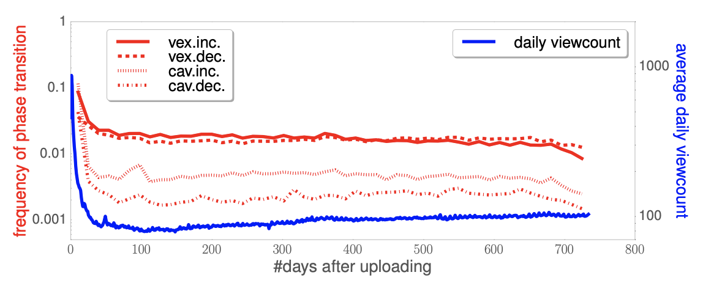
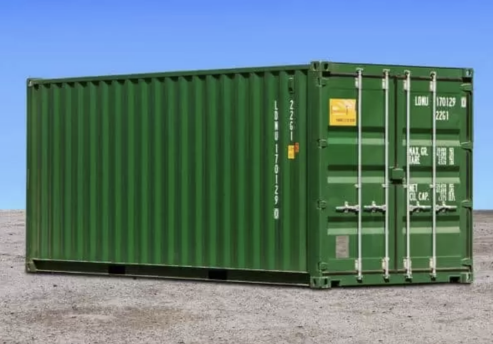
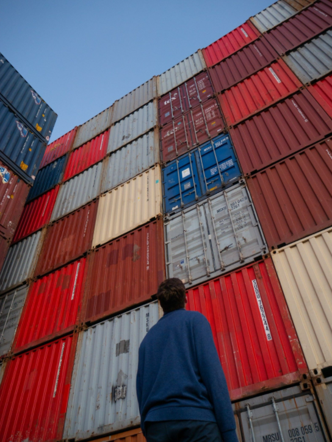
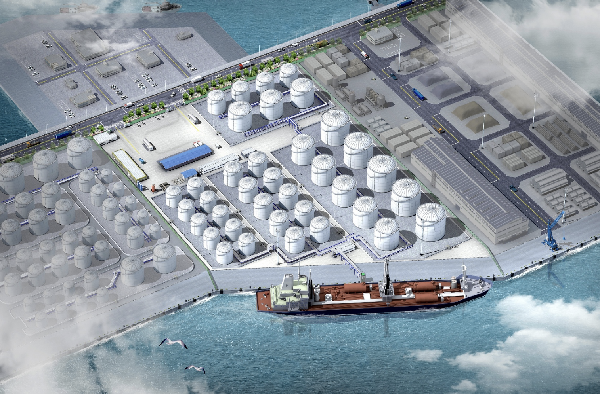
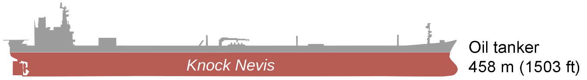
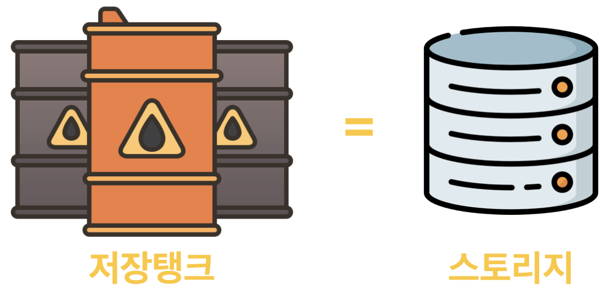
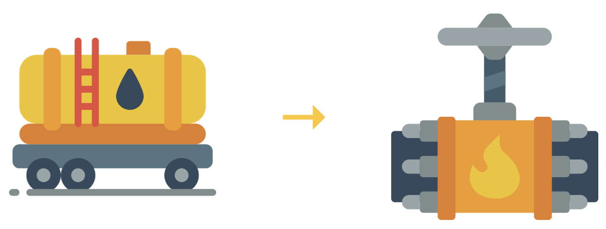

.. _intro:

1장. M2
**********************************

**M2** 는 실시간(On the fly) 파이프라인를 구현하는 플랫폼이다.

.. note::

   ``M2`` 유스 케이스는 `Contents Service Patterns <https://csp-kr.readthedocs.io/ko/latest/>`_ 으로 제공된다.

이 문서를 통해 왜 **M2** 의 On-the-fly가 최선의 **Workload Processing** 방식인지 설명한다.

지난 10년 동안 컴퓨팅 환경은 크게 변화하했다.

   -  PC에서 Mobile로
   -  Monolithic Archicurecture에서 Micro-Service Architecture로
   -  Single Core에서 Multi Core로
   -  On-Premise에서 Cloud로

하지만 **Workload** 를 처리하는 엔터프라이즈의 보수적인 인식은 크게 변하지 않았다.
그 중심에는 **Batch Processing (이하 Batch)** 이 다양한 형태로 자리잡고 있었다. 

   -  Batch process
   -  Migration
   -  Workflow
   -  Pipeline
   -  Legacy System

.. toctree::
   :maxdepth: 2

휘발성 콘텐츠
===================

일상적으로 소비하는 온라인 컨텐츠의 대부분은 휘발성이다. 

이커머스(E-Commerce)를 예로 들어 보자.
이커머스에서는 상품판매를 위해 이미지와 설명을 사용자에게 끊임없이 노출시킨다.
이러한 노출방식이 변화에 빠르게 대응하지 못한다면 판매량을 지속시킬 수 없다.

-  계절마다 해마다 트렌트에 따라 변화하는 패션
-  매년 업그레이드되는 스마트 디바이스
-  노출방식에 꾸준히 변화를 주는 명품 가방

**콘텐츠는 유행이다.**
상품이 소비자의 관심을 끌지 못하거나 가치가 낮아져 구매로 이어지지 않는다면 유통기한이 만료된 것이다.
온라인에서 소비되는 비디오 컨텐츠 조차도 유사한 성질을 가진다.

-  유튜브 동영상의 소비 패턴은 단 3주면 꺾인다.
-  지난 주에 보았던 뉴스 기사의 이미지를 기억하는가?
-  어제 인스타그램에 보았던 사진이 뭐였지?
-  오늘 아침 출근길에 검색했던 상품 이미지가 무엇이었나?

많은 자료가 급격하게 저하되는 소비 패턴을 증명한다.

온라인 콘텐츠는 전단지와 유사하다.
누구도 뿌려지는 전단지를 모아두지 않는다. 
기간이 만료되면, 그 정보의 가치는 “0”이기 때문이다.

.. figure:: img/nobatch03.png
   :align: center

상품 이미지 자체는 고객에게 파는 상품이 아닌 판촉 활동을 위한 도구이다. 
하지만, 상품 이미지를 다루는 방식은 마치 그 자체가 상품인 것처럼 소중히 다루어지는 경향이 있다.
여기에 괴리가 있다.

이커머스에서 이미지는 소비되는 특성에 맞게 다뤄져야 한다. 
그러나 여전히 많은 이커머스에서 이미지는 여전히 고전적인 Batch에 의존하고 있다. 
심지어 클라우드 서비스들, 시장의 다양한 이미지 솔루션/서비스들이 Batch를 더 고집하게 만들어 효율성과 기민함을 저하시키고 있다.
이제 이커머스의 방대한 복잡도에서 Batch는 합리적인 전략이 아니다. 

배치는 왜 실패할까?
===================

배치의 진행 단계를 살펴보자.

   1. 작업 목록을 작성한다.
   2. 대상 서버들을 산정한다.
   3. 프로세스를 수행한다.
   4. ...........기다린다........
   5. ...기도한다...기도한다...기도한다...기도한다...기도한다
      
      .. figure:: img/nobatch04.png
         :align: center

   6. “Complete” 메시지를 보며 신의 존재를 느낀다.

이 방식은 곧 한계를 드러냈는데 (신이 없었기 때문이 아니라) 배치 프로세스의 근본적인 문제 때문이다.

Batch가 실패하는 대표적인 이유는 2가지이다.

첫째, **배치는 항상 Legacy를 남긴다.**
레거시는 다소 부정적인 의미를 가지는데 대충 **“구축해서 돌고 있지만, 건드릴 수 없는 시스템”** 정도로 이해할 수 있다. 
배치 결과물은 어딘가에 저장되어야 한다. 
그리고 이 단정적 저장을 전제로 개발이 이루어진다. 

최악은 배치를 관리할 목적으로 만들어진 DB(데이터 베이스) 기반 시스템이다. 
DB를 넣는 순간 주객이 전도되어 DB 관리가 첫 번째 미션이 된다.
몇 달 뒤 기획이 바뀌는 순간 모든 배치는 수습해야할 대상이 되버리고 겨울이 시작된다. 

이 빡빡한 레거시의 콜라보레이션 안에 어떻게 새로운 기능을 집어 넣을 수 있겠는가?

둘째는 통제 모델의 한계 때문이다. 
배치를 시작하려면 항상 작업규모를 설정해야 한다. 
그리고 최선을 다해서 실행한다. 
이 모델이 매우 당연하게 여겨진다면 다음 문제에 대해 생각해보자.

   - 모든 상품 이미지에 대해 신규 썸네일 해상도를 지원하는데 얼마나 소요될까요?
   - 최신 아이폰 해상도에 맞추어 모든 상품기술서를 변경하는데 얼마나 소요될까요?
   - 상품이 계속 유입되는데 내일 아침 서비스에 노출할 수 있을까요?

서비스가 커질수록 변동성/불확실성은 커지게 되고 임계점을 넘어가는 순간 지금껏 유효했던 해법들은 한계를 드러낸다. 
이러한 기술부채를 갚지 못한다면 영원한 이자를 내야 한다.

.. figure:: img/nobatch09.png
   :align: center

변동성/불확실성은 통제할 수 있는 대상이 아니라 기민(Agile)하게 적응해야 하는 대상이다.

기름 운송모델의 비유
===================

컨테이너 문제
------------------------------------

컨테이너 운송은 배치 모델과 닮아있다. 

컨테이너는 규격화된 크기와 높은 운송 편의성으로 화물 운송 사업에서는 필수적인 요소이다. 
화물의 안전한 보관과 적재 공간을 절약할 수 있는 장점이 있다. 
그리고, 항만에 적재된 컨테이너를 화물선에 옮겨 싣고 다시 화물차로 이동하여 운송하는 과정의 모든 것이 기계적으로 자동화되어 있다. 
하지만 이 모든 과정에는 상당한 경험과 노하우, 그리고 정교한 시스템이 바탕에 있어야 한다.

컨테이너 자체는 규격화되어 있지만, 온전한 시스템이 기반이 되지 않은 상태에서 양의 문제로 넘어가면 완전히 다른 양상이 펼쳐진다. 
컨테이너가 단 두 개만이라도 해법은 쉽지 않다.  

-  하단에 위치한 컨테이너를 어떻게 빼내야 할까?
-  컨테이너 내부 물건을 어떻게 꺼내야 할까? 
-  중간에 위치한 컨테이너의 내용물만을 어떻게 폐기할까? 

언뜻 단순해 보이지만 경제적인 해법을 찾는 것은 만만치 않다.
단기적인 목적을 위해 값비싼 이동 장비를 무작정 구매할 수도 없는 노릇이다.

Oil Tanker와 Oil Pipeline
------------------------------------

Oil 파이프라인 수송(Oil Pipeline Transport)의 접근 방식은 ``M2`` 에서 추구하는 On-the-fly 컨셉과 매우 닮아 있다. 
또한, 유조선(Oil Tanker)은 Batch로 이해할 수 있다.

기름은 연료이다. 
연료는 연소를 통해 연소열을 만들어낸다. 
하지만, 연료 그 자체가 목적이 아닌, 열을 내어 난방을 하던, 자동차 엔진을 구동하던지의 본연의 목적을 위한 에너지원으로 활용하는 물질이다.

.. note::

   이커머스에서는 상품 이미지가 엔진을 위한 연료의 역할을 하게 된다. 

연료를 운반하는 방식에서 **유조선은 Batch, 오일 파이프라인을 On-the-fly** 로 대조해 볼 수 있다. 
유조선은 대륙 간에 바다를 통해 연료를 운송하는 데에 적합하다. 

그런데, 유조선을 띄우는 과정이 복잡하고 비싸다보니 한번에 많은 양의 기름을 실어서 운송하게 된다. 
그러다보니, 유조선은 갈 수록 커지고, 항만에 유류를 저장할 저장탱크도 덩달아 커진다.
자연히 관리 비용이 급격하게 높아지게 될 뿐만 아니라, 사고에 대한 리스크도 커지게 된다.

이미 유조선은 축구 경기장의 4배가 넘는 규모가 넘는데, 유조선의 사고 빈도가 지속적으로 증가해서 해마다 100여건에 가깝게 나타나고 있다. 
IT에서 Batch의 문제도 같은 맥락이다. 
Batch의 단위 작업이 초기에는 단순하고 작지만, 서비스의 규모가 커지면 마치 유조선과 유류 저장 탱크가 커지는 것처럼 단위 작업의 규모, 복잡도가 커진다. 
스토리지의 규모가 증가하면서 저장 비용도 동반 상승한다.

미주나 유럽 대륙 내에서는 일찍이 파이프라인 도입이 활발하게 되었는데, 아무리 유조선이 크고, 유류차량으로 이동할 수 있다고는 하지만 파이프라인의 경제성에는 도저히 따라올 수가 없기 때문이다. 
``M2`` 는 산지에서 파이프라인으로 수송하는 모델이다. 

On the fly Pipeline
------------------------------------

``M2`` 는 Batch의 문제점을 극복하기 위해 모든 기능들을 On-the-fly 아키텍쳐로 설계하였다.

   - 데이터 저장과 가공
   - 클라이언트 트래픽 처리
   - 이미지 가공과 전달
   - 보안 필터연결
   - 웹 페이지 처리 엔진
   - 비디오 분석/가공 엔진
   

이상의 비즈니스 문제에 대한 모든 관점을 On-the-fly로 해결한다. 

이커머스 이미지를 포함한 컨텐츠의 처리와 전달을 On-the-fly로 해결해야하는 이유는 명확하다. 
이미지라는 휘발성 컨텐츠 연료를 통해서 매출을 창출하는 것이 본질이기 때문이다.

.. note::

   이 시장엔 끊임없이 단어 만들기를 좋아하는 사람들이 ``Batch Pipeline`` 이란 용어를 만들어 냈다. 
   이 단어는 종종 ``On-the-fly`` 의 대척점에 서는데 용어가 데이터 분석으로부터 유래되었다는 점을 생각하면 억지스러운 점이 있다. 

연료가 불타고 사라지는 것처럼 이커머스 이미지도 소비되면 사라져야 한다.
강력한 연소(=on the fly 프로세싱)과 상태를 관리하지 않는 것(Stateless), 이 것이 ``M2`` 의 본질이다.
   

이제 On-the-fly로 관점을 전환할 때
===================

근본적인 관점의 전환은 모든 것을 바꾼다.
비즈니스 문제를 On-the-fly 관점에서 바라보는 것만으로도 믿을 수 없이 유연하고 경제적인 해답을 얻을 수 있다.
더 놀라운 점은 기존의 인프라 환경을 변화시키지 않고 당장 실천할 수 있다는 점이다.

다음은 ``M2`` Layer가 바꾸어 놓은 사례이다.

   - 데이터 마이그레이션과 서비스를 동시에 수행한다.
   - 사용자에게 전달하는 이미지 형태를 미리 만들어 두지 않는다.
   - 사전에 기획된 이메일 마케팅, 이제는 여는 시점에 조합된 최신의 데이터로 생성 후 사용자에게 전달한다.
   - 모든 영역의 콘텐츠를 개인화한다.
   - Mixed Content. 제휴 사업자 컨텐츠가 얼마나 많은지, 얼마나 소비될지 몰라도 대처가 가능하다.
   - 덩치 큰 동영상. 사이즈마다 모두 미리 트랜스코딩하지 않는다. 저장 비용까지 아끼는 것은 덤.
   - 동영상 속 썸네일 이미지 추출. API 콜 하나로 끝.
   - 너무나 긴 상품 이미지. 디자이너가 일일이 자르는 건 그만! 자동화한다.
   - 더 이상 디자이너가 일일이 문구를 수정하지 않는다.

더 많은 사례는 `Contents Service Patterns <https://csp-kr.readthedocs.io/ko/latest/>`_ 를 통해 제공된다.

.. note::

   배치는 그 결과물의 가치가 저장/관리 비용보다 높을 때에만 유의미하다. 
   그렇지 않다면 배치는 레거시다.
   그 형태가 프로그램, 파일, DB, 파이프라인 어떤 것이든 이자를 피할 수 없다.

