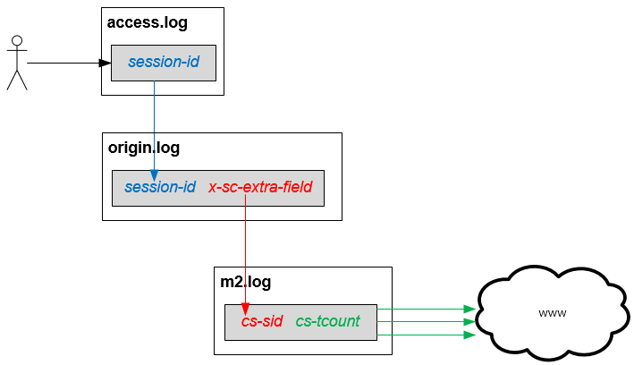

.. _log-analyze:

8장. 로그분석
******************

이 장에서는 로그를 분석하는 방법에 대해 설명한다.

로그를 통해 어떠한 장애라도 설명이 가능하다.
흔히들 M2가 참조하는 리소스가 다양할수록 장애파악이 어렵다고 생각한다.
하지만 문제를 일으키는 순간의 리소스는 단 하나이고 M2를 이를 충분히 증명가능한 상태로 제공한다.

.. _log-analyze-relation:

로그 관계
====================================

M2는 3가지의 로그를 제공하며 각 로그를 연결하는 고리는 다음과 같다.

-  **access.log** `링크 <https://ston.readthedocs.io/ko/latest/admin/log.html#access>`_
   모든 클라이언트의 HTTP 트랜잭션을 기록한다.
   
   -  ``session-id`` 클라이언트 TCP 세션이 접속할 때 부여된다.

-  **origin.log** `링크 <https://ston.readthedocs.io/ko/latest/admin/log.html#origin>`_
   캐싱엔진에서 HIT되지 않고 M2모듈로 처리가 위임된 요청을 기록한다.

   -  ``session-id`` 원본서버(M2) 요청을 발생시킨 클라이언트 세션 ID. access.log의 ``session-id`` 와 같다.
   -  ``sc-extra-field`` M2가 진행한 트랜잭션 ID   

-  **m2.log**
   M2의 각 엔드포인트에서 진행한 HTTP 트랜잭션을 개별로 진행한다.
   3개의 이미지를 다운로드 받아 합성했다면 3개의 트랜잭션 로그가 남는다.
   M2의 형식은 **origin.log** 와 동일하다.

   -  ``cs-sid`` M2가 진행한 트랜잭션 ID. origin.log의 ``session-id`` 와 같다.
   -  ``cs-tcount`` M2 트랜잭션 내에서 진행한 개별 HTTP 트랜잭션 ID. 이 값은 각 M2 트랜잭션마다 1부터 시작한다.

.. note::

   **origin.log** 라는 이름은 캐싱엔진에서 유래한다. 
   캐싱엔진에서는 M2도 다른 웹서버와 동등한 캐싱대상이기에 원본(=origin)으로 바라볼 수 있다.

.. _log-analyze-debug-header:

디버깅 헤더
====================================

M2 트랜잭션이 비정상 처리되었다면 다음 헤더를 제공한다. ::

   HTTP/1.1 500 Internal Error
   ... (생략) ...
   x-ston-sessionid: 126
   x-m2-tid: 26576nYLiaXRK
   x-m2-error-url: http://foo.com/not/found;404
   x-m2-error-url: http://bar.com/where/is/it;404

``wget`` 등의 커맨드를 통해 장애 범위를 좁힐 수 있다.

-  ``x-m2-tid``

   -  origin.log의 ``sc-extra-field`` 필드
   -  m2.log의 ``cs-sid`` 필드

-  ``x-m2-error-url``
   참조시 문제가 된 URL과 원인