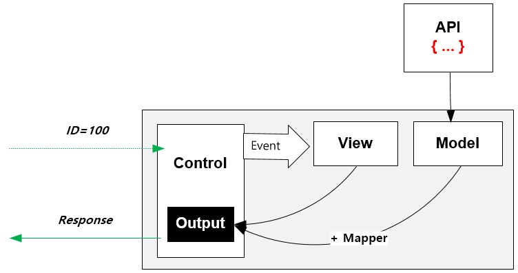
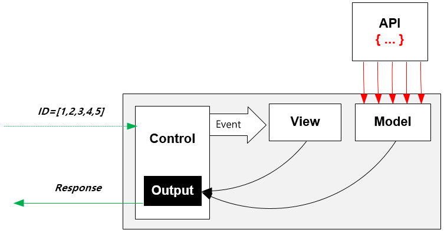

.. _model:

5장. Model
******************

이 장에서는 엔드포인트가 참조하는 오브젝트 모델인 ``M2-JSON`` 에 대해 설명한다.
일반적으로 RESTful API로 제공되는 JSON이나, HTML처럼 사람이 읽을 수 있는 포맷을 의미한다. 

다음과 같이 엔드포인트가 설정되어 있다고 가정한다. ::

   # vhosts.xml - <Vhosts><Vhost><M2><Endpoints>

   <Endpoint>
      <Model>
         <Source>https://foo.com/#model</Source>
      </Model>      
      <View> ... </View>
      <Control>
         <Path>/fruits</Path>
      </Control>
   </Endpoint>

M2-JSON 구조
====================================

예를 들어 엔드포인트를 ``/fruits`` 로 설정했으므로 클라이언트는 다음과 같이 호출한다. ::

   /fruits?model=apple&view=list

M2는 ``<Source>`` 설정에 따라 다음 주소를 호출한다. ::

   https://foo.com/apple

``foo.com`` 은 아래와 같이 응답한다.

::

   {
      "name" : "Apple",
      "image" : "https://upload.wikimedia.org/wikipedia/commons/thumb/1/15/Red_Apple.jpg/265px-Red_Apple.jpg",
      "price" : 35
   }

이상의 응답을 포함한 모든 컨텍스트 정보의 집합을 ``M2-JSON`` 이라고 부른다. ``M2-JSON`` 은 ``model`` 과 ``req`` 나뉘며 다음과 같이 구성된다. ::

   {
      "model": {
         "name" : "Apple",
         "image" : "https://upload.wikimedia.org/wikipedia/commons/thumb/1/15/Red_Apple.jpg/265px-Red_Apple.jpg",
         "price" : 35
      },
      "req": { ... }
   }

``M2-JSON`` 은 뷰 파일에서 다음과 같이 참조한다. ::

   {{ model.name }}   

.. note::

   ``M2-JSON`` 의 ``"model"`` 은 고정이 아니다. ::

      <Control>
         <Path ModelParam="myData">/fruits</Path>
      </Control>
   
   이런 경우 ``"myData"`` 를 키로 사용한다. ::

      {
         "myData": { ... },         
         "req": { ... }
      }

``req`` 필드
------------------------------------

클라이언트가 호출한 요청 정보는 ``req`` 필드에 저장된다. ::

   {
      "model": { ... },
      "req": {
         "headers": {
            "host": "www.example.com:8585",
            "if-modified-since": "Mon, 13 Apr 2020 06:41:28 GMT",
            "user-agent": "Mozilla/5.0 (Windows NT 10.0; Win64; x64) AppleWebKit/537.36 (KHTML, like Gecko) Chrome/74.0.3729.157 Safari/537.36",
            "accept-encoding": "gzip"
         },
         "hostname": "www.example.com",
         "httpVersion": "1.1",
         "method": "GET",
         "path": "/fruits",
         "protocol": "http",
         "query": {
            "model": "apple",
            "view": "list"
         },
         "url": "/fruits?model=apple&view=list",
         "xhr": false,
         "fullUrl": "http://www.example.com/fruits?model=apple&view=list"
      }
   }

``"req"`` 하위 키는 다음과 같다.

-  ``headers`` - 클라이언트 요청헤더 목록
-  ``hostname`` - 요청 호스트 이름
-  ``httpVersion`` - HTTP 버전
-  ``method`` - HTTP 메소드
-  ``path`` - 요청 URL 중 경로 정보
-  ``protocol`` - 프로토콜
-  ``query`` - 쿼리스트링 키/값 리스트
-  ``url`` - 요청 URL 정보
-  ``xhr`` - Ajax에 의한 요청 여부 ( ``true`` 인 경우 Ajax호출)
-  ``fullUrl`` - 호스트 정보를 포함한 요청 UR

.. _model-array:

모델 배열
------------------------------------

모델 배열이 필요한 경우 ``#model`` 값을 ``[ ... ]`` 형식으로 입력한다. ::

   /fruits?model=[apple,banana,pineapple]&view=list

``<Source>`` 에 설정된 주소에 각각의 값을 바인딩하여 결과를 배열로 취합한다. ::

   {
      "model" : [
         {
            "name" : "Apple",
            "image" : "https://upload.wikimedia.org/wikipedia/commons/thumb/1/15/Red_Apple.jpg/265px-Red_Apple.jpg",
            "price" : 35
         }, {
            "name" : "Banana",
            "image" : "https://upload.wikimedia.org/wikipedia/commons/thumb/4/44/Bananas_white_background_DS.jpg/320px-Bananas_white_background_DS.jpg",
            "price" : 12
         }, {
            "name" : "Pineapple",
            "image" : "https://upload.wikimedia.org/wikipedia/commons/thumb/c/cb/Pineapple_and_cross_section.jpg/286px-Pineapple_and_cross_section.jpg",
            "price" : 200
         }
      ],
      "req" : { ... }
   }

``"Banana"`` 의 ``"image"`` 필드는 다음과 같이 참조한다. ::

   {{ model[1].image }}

모델 배열을 생성하기 위해 엔드포인트는 다음 API들을 호출한다. ::

   https://foo.com/apple
   https://foo.com/banana
   https://foo.com/pineapple

모델 배열에서는 API 호출실패시 동작방식을 미리 생각해 두는 것이 안전하다. ::

   # vhosts.xml - <Vhosts><Vhost><M2><Endpoints><Endpoint>

   <Model>
      <Source>https://foo.com/#model</Source>
      <Sparse>ON</Sparse>
   </Model>

-  ``<Sparse> (기본: OFF)`` 모델 참조가 하나라도 실패하면 실패처리한다. ``ON`` 설정이라면 모든 모델 참조가 실패할 경우에만 실패처리 된다.

예를 들어 ``<Sparse>ON</Sparse>`` 인 상황에서 ``apple`` 과 ``pineapple`` 의 모델 참조가 실패하면 모델 배열은 다음과 같이 구성된다. ::

   {
      "model" : [
         { },
         {
            "name" : "Banana",
            "image" : "https://upload.wikimedia.org/wikipedia/commons/thumb/4/44/Bananas_white_background_DS.jpg/320px-Bananas_white_background_DS.jpg",
            "price" : 12
         },
         { }
      ]
   }

Mapper
====================================

반드시 ``<Source>`` 의 포맷이 ``JSON`` 일 필요는 없다.
맵퍼(Mapper)를 이용해 다양한 소스를 ``M2-JSON`` 으로 맵핑(Mapping)할 수 있다.

.. figure:: img/m2_userguide_04.png
    :align: center

맵퍼는 ``JSON`` 으로 정의한다. ::

   # vhosts.xml - <Vhosts><Vhost><M2><Endpoints><Endpoint>

   <Model>
      <Source>https://foo.com/#model</Source>
      <Mapper>https://foo.com/mapper.json</Mapper>
   </Model>      

.. note::

   ``<Mapper>`` 와 ``<Source>`` 는 1:N 관계이다.

   -  ``<Source>`` 는 상품정보처럼 다양하지만 그 형식은 단일하다. 그러므로 ``<Source>`` 를 해석/맵핑하는 방식은 단일하다.
   -  만약 단일한 모델 URL의 해석/맵핑 방식이 다양하다면 각각 구분된 ``<Endpoint>`` 로 구성하는 것이 바람직하다.

``M2-JSON`` 은 정보를 다루기 위한 ``JSON`` 포맷을 지칭하는 것일 뿐, 그 자체가 특별한 의미를 가지지 않는다. ::

   {
      "firstName": "...",
      "address": {
         "streetAddress": "...",
         "city": "..."
      },
      "phoneNumber": ["..."]
   }

규칙은 간단하다.

-  값 참조 구분자는 ``space/공백문자`` 이다. 예로 웹 페이지의 타이틀은 ``"html head title"`` 으로 표현한다.
-  맵핑하고 싶은 대상이 복수인 경우 값을 배열 ``["..."]`` 로 한다.

맵퍼가 사용되면 ``M2-JSON`` 에 추가필드가 생성된다. ::

   {
      "model": {
         ...,
         "__url": "https://foo.com/apple",
         "__raw": " <!DOCTYPE html PUBLIC "-//W3C//DTD XHTML 1.0 Transitional//EN" "http://www.w3.org/TR/xhtml1/DTD/xhtml1-transitional.dtd"> ..."
      },
      "req": { ... }
   }

-  ``__url`` - 엔드포인트가 호출한 URL
-  ``__raw`` - 원시(RAW) 데이터

JSON
---------------------------------------

-  ``JSON`` 은 별도의 맵핑 없이 ``M2-JSON`` 으로 사용 가능하다.

HTML/XML
---------------------------------------

-  ``HTML`` 과 ``XML`` 맵핑 규칙은 동일하며 추가적인 표현을 제공한다.
-  ``class`` 는 접두어 ``#`` 으로 참조한다.
-  ``id`` 는 접두어 . 으로 참조한다.
-  ``<Element>`` 의 속성은 ``Element.속성키`` 으로 참조한다.

::

   <!DOCTYPE html>
   <html>
      
      <head>
         <title>Amazon.com: Online Shopping</title>
      </head>
      <body>        
         <h1>Amazon.com, Inc.</h1>
         
         
is an American multinational technology company 

         
based in Seattle that focuses on e-commerce,

         
cloud computing, digital streaming, and artificial intelligence.

      </body>
   </html>

예제 ``HTML`` 은 다음과 같이 맵핑 가능하다. ::

   {
      "myTitle" : "html head title",
      "meta" : {
         "logo" : "#foobar img.src",
         "name" : "html body h1",
      },
      "descriptions" : [ ".foo"],
   }

위 맵핑은 아래와 같은 ``M2-JSON`` 으로 변환된다. ::

   {
      "myTitle" : "Amazon.com: Online Shopping",
      "meta" : {
         "logo" : "https://amazon.com/logo.jpg",
         "name" : "Amazon.com, Inc.",
      },
      "descriptions" : [ 
         "is an American multinational technology company",
         "based in Seattle that focuses on e-commerce,",
         "cloud computing, digital streaming, and artificial intelligence."
      ]
   }

모델 결합
====================================

``<Endpoint>`` 는 독립적으로 서로 영향을 받지 않는다. ::

   # vhosts.xml - <Vhosts><Vhost>

   <M2 Status="Active">
      <Endpoints>
         <Endpoint Alias="inven"> ... </Endpoint>
         <Endpoint Alias="golduser"> ... </Endpoint>
      </Endpoints>
   </M2>

.. figure:: img/m2_userguide_05.png
    :align: center

두 모델의 값을 비교,연산해야하는 경우, 둘을 결합하는 ``<Endpoint>`` 를 추가한다. ::

   # vhosts.xml - <Vhosts><Vhost>
   
   <M2 Status="Active">
      <Endpoints>
         <Endpoint Alias="inven"> ... </Endpoint>
         <Endpoint Alias="golduser"> ... </Endpoint>
         <Endpoint Alias="golditem">
            <Control>
               <Path>/items/gold</Path>
            </Control>
            <Model>
               <Mapper>https://foo.com/mapper.json</Mapper>
            </Model>
            <View>
               <Source>https://bar.com/#view</Source>
            </View>
         </Endpoint>
      </Endpoints>
   </M2>

-  ``<Model>`` 하위에 ``<Source>`` 가 없다면 모델 결합을 위한 ``<Endpoint>`` 로 인식한다.
-  ``@Alias`` 를 통해 다른 ``M2-JSON`` 을 참조한다. (예. ``@inven`` , ``@golduser`` )

결합 맵퍼는 다음과 같이 작성한다. ::

   {
      "item" : {
         "inventory" : "@inven",
         "user" : "@golduser"
      },
      "description" : "this is a compound model"
   }

.. figure:: img/m2_userguide_06.png
    :align: center

``@Alias`` 뒤에 뷰를 명시하면 ``M2-JSON`` 을 가공한 뷰를 참조할 수 있다. 단, 해당 뷰의 형식은 반드시 ``JSON`` 이어야 한다.

.. figure:: img/m2_userguide_07.png
    :align: center

예제의 ``golditem`` 는 ``@inven`` 과 ``@golduser`` 의 엔드포인트를 참조한다. 따라서 각각의 모델 값을 ``키:값`` 을 콤마로 구분한다. ::

   /items/gold?mode=inven:1000,golduser:javalive&view=img
