.. _use-cases:

2장. Use Cases
******************

이 장에서는 M2의 활용범위 및 도입사례에 대해 설명한다.

.. note::

   `Contents Service Patterns <https://csp-kr.readthedocs.io/ko/latest/>`_ 을 통해 더 상세한 내용을 제공한다.

Microservice로의 아키텍처 변화는 많은 장점을 가지지만, 데이터 바인딩과 통합문제는 단점으로 꼽힌다.

.. figure:: img/m2_12.png
   :align: center

다양한 `프런트엔드 프레임워크 <https://www.bitdegree.org/tutorials/front-end-frameworks/>`_ 가 이 문제를 다루고 있지만 지나치게 기술지향적인건 아닌지 생각해 보아야 한다.

-  개발자만의 기술잔치
-  서버운영의 복잡성 증가와 비용상승
-  기획/마케팅팀의 참여방해

또한 이메일 클라이언트처럼 제약사항이 많은 환경이라면 고려사항이 더 많다.

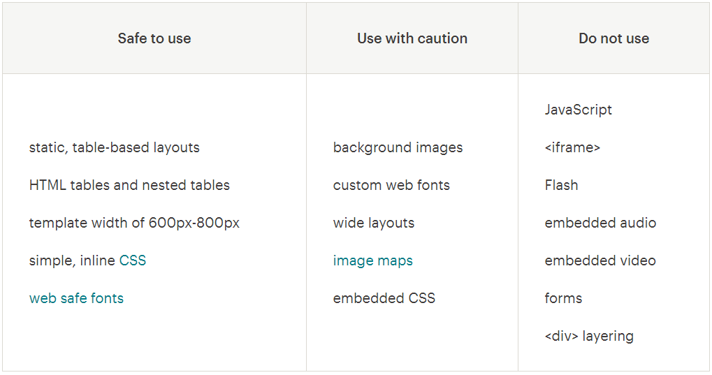

   `메일침프 - Limitations of HTML Email <https://mailchimp.com/help/limitations-of-html-email/>`_ 발췌

M2는 복잡한 단계를 압축할 뿐만 아니라 기획/마케팅팀에게 필요한 가시성있는 결과물을 일관성있게 생산한다.

.. toctree::
   :maxdepth: 2

위젯
====================================

검색, 리뷰, 추천등의 독립된 정보를 다양한 위젯으로 제공한다.

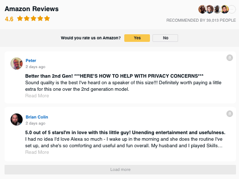

:ref:`model-array` 을 사용하면 손쉽게 디자인에 데이터를 맵핑할 수 있다.

.. _use-cases-image-server:

배너 이미지
====================================

가격, 재고, 판매량등의 실시간 정보가 반영되는 이미지를 생산한다.

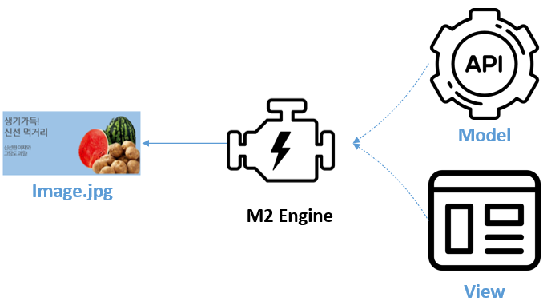

=========================== ========================== ============================
항목                         M2                         기존 프로세스
=========================== ========================== ============================
방식                         On the fly                 Batch
서비스 투입                  즉시                        Batch 프로세스 종료 후
저장공간                     STON 캐싱엔진 (LRU)         Storage
형태                         단독 솔루션                 백엔드 시스템
유연성                       API 기반의 높은 유연성       낮음
데이터 변경 반영              즉시                        전체 이미지 일괄재생산
성능                         높음                        낮음
연동범위                      WWW                        기업 백엔드
2차 이미지 가공               STON 이미지툴               추가 프로세스 필요
=========================== ========================== ============================

약속된 이미지 규격(View)에 상품정보를 결합하면 모든 상품의 이미지를 즉시 서비스하거나 변경할 수 있다.

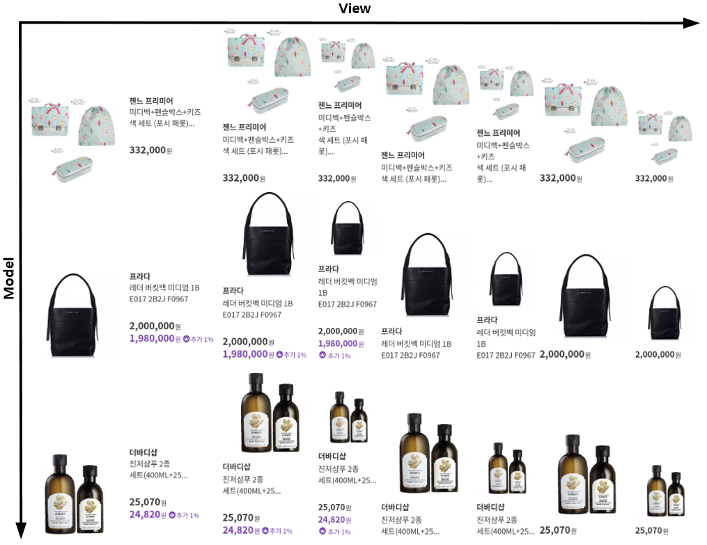

`STON 이미지 툴 <https://ston.readthedocs.io/ko/latest/admin/image.html>`_ 과의 결합을 통해 사용성이 한층 높아진다. ::

   http://example.com/m2-endpoint?model=html&view=jpg/imagetool/resize/100x100
   http://example.com/m2-endpoint?model=html&view=jpg/imagetool/format/webp

How it works
-----------------------------------------------

-  소스는 이미 존재하는 웹 페이지 `HTML` 또는 상품 API(`JSON`)를 이용한다.
-  소스를 반영할 이미지 템플릿은 `HTML` / `CSS` 를 통해 제작한다.
-  출력 포맷(`JPG`, `PNG`, `WEBP`, `BMP`, `PDF`)을 지정하고 URL을 게시한다.

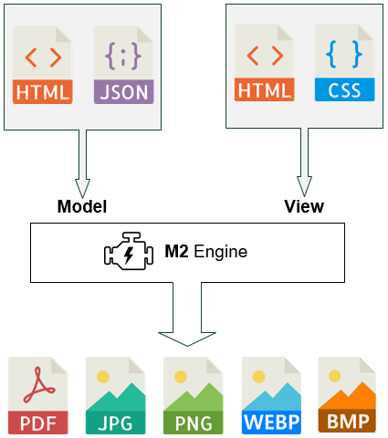

상품기술서 최적화
====================================

상품기술서 관리가 어려운 이유는 개수가 많고 용량이 크기 때문이다.
특히 셀러들에 의해 무분별하게 생성되는 기술서는 혼란을 가중시킨다.

-  고용량 이미지 용량절감

   .. figure:: img/m2_17.png
      :align: center

-  이미지 분할을 통한 로딩품질 개선

   .. figure:: img/m2_18.png
      :align: center

-  반응형 레이아웃 및 스타일 최적화 (고정 사이즈 해체)

   .. figure:: img/m2_19.png
      :align: center

M2는 상품기술서나 백엔드 수정없이 즉시 원하는 스타일과 반응성을 제공한다.

혼합 콘텐츠 문제해결
====================================

오래전부터 누적되온 상품기술서는 HTTP 프로토콜을 사용하는 경우가 많다.

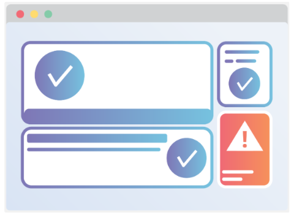

HTTPS를 전면도입할 경우 상품기술서안에 하드코딩된 HTTP 리소스 참조는 `혼합 콘텐츠 (Mixed Content) <https://developers.google.com/web/fundamentals/security/prevent-mixed-content/what-is-mixed-content?hl=ko>`_ 문제를 야기한다.

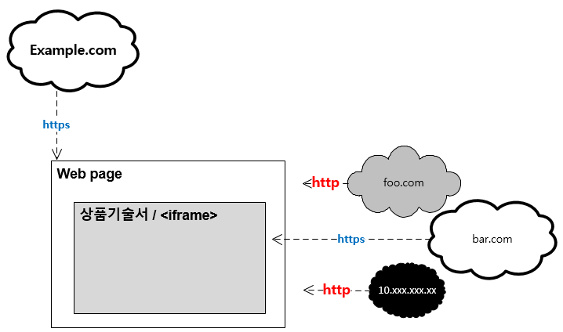

위 동작은 크롬등의 최신 브라우저에서 다음과 같이 차단된다. 

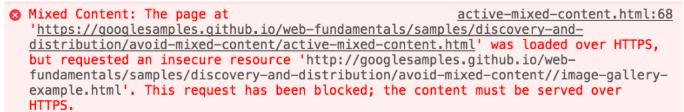

M2는 혼합 콘텐츠 문제를 전송 전에 미리 감지하여 안전하게 로딩시킨다.

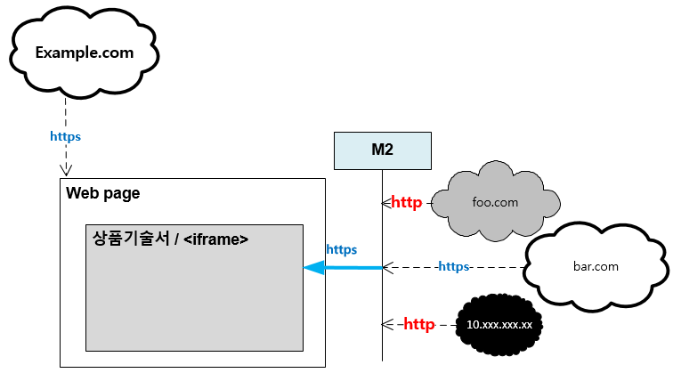

이미지 게이트웨이
====================================

불특정 서버에 존재하는 이미지를 자사 백엔드를 통해 투명하게 서비스한다.

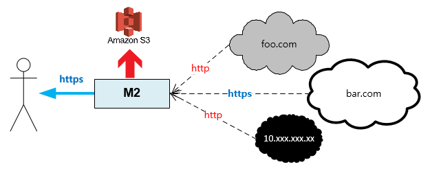

외부 이미지를 가져옴과 동시에 부가 작업을 수행할 수 있다.

-  이미지 최적화
-  스토리지 백업 (S3 등)
-  API 리포팅

웹사이트 스냅샷
====================================

웹사이트를 다양한 해상도의 스냅샷(이미지, PDF)으로 출력한다.

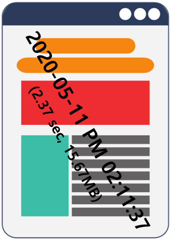

화면캡쳐 뿐만 아니라 메타 정보에 대해 추가도 가능하다.

-  날짜
-  HTTP 요청 정보
-  로딩 속도
-  장애 콘텐츠 감지

동영상/GIF 제작
====================================

1번의 호출로 약속된 규격의 동영상. Animated GIF 제작이 손쉽게 가능하다.

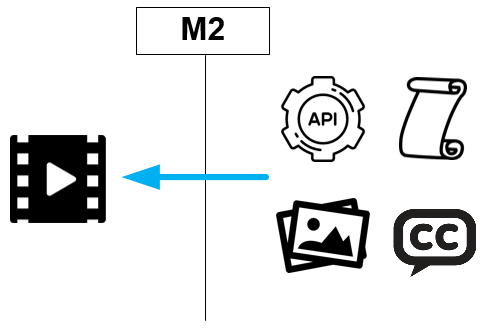

-  정적이미지를 손쉽게 Animated GIF로 변환
-  검색, 추천등 단조로운 열거형 데이터를 동영상/GIF로 제공
-  무거운 Animated GIF를 MP4 비디오로 트랜스코딩

자세한 내용은 :ref:`view-mp4-gif` 를 참고한다.

Web API 서버
====================================

웹 페이지를 수정 없이 Web API로 제공한다.

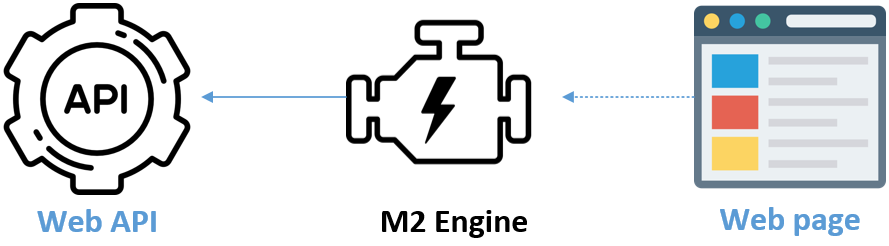

How it works
-----------------------------------------------

-  소스는 이미 존재하는 웹 페이지( `HTML` )를 이용한다.
-  소스를 `JSON` 으로 맵핑한다.
-  엔드포인트를 게시한다.

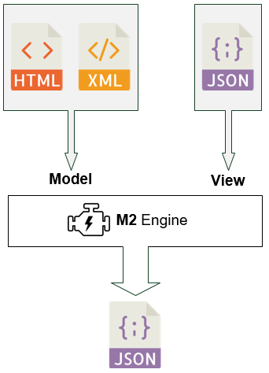