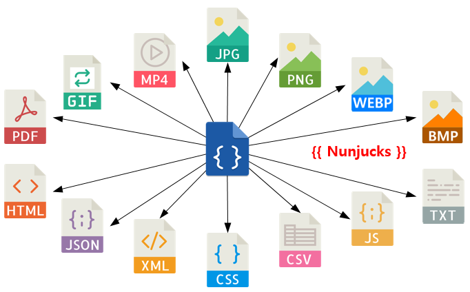
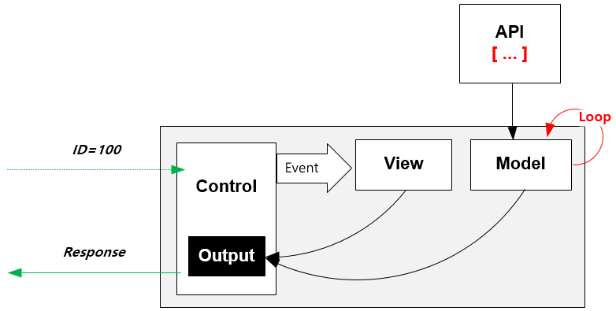
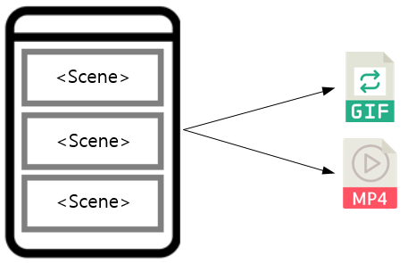

.. _view:

6장. View
******************

이 장에서는 뷰(View)에 대해 설명한다.
뷰(View) 파일이란 출력물을 생성하는 템플릿을 의미한다. ::

   # vhosts.xml - <Vhosts><Vhost><M2><Endpoints><Endpoint>

   <View>
      <Source Mandatory="off">https://bar.com/#view</Source>
      <WellFormed>ON</WellFormed>
   </View>

-  ``<Source>`` 뷰 파일을 게시한 URL

   -  ``Mandatory`` 클라이언트가 ``#view`` 파라미터를 입력하지 않은 경우 동작방식

      -  ``Off (기본)`` ``M2-JSON`` 을 ``200 ok`` 로 응답한다. 디버깅에 유용하다.

      -  ``ON`` ``400 bad request`` 로 응답한다.

-  ``<WellFormed>`` 생성된 뷰 파일이 문법에 맞도록(well-formed) 보정한다.

   -  ``Off`` 보정하지 않는다.

   -  ``ON (기본)`` 문법에 맞도록 보정한다.
 

.. _view-nunjucks:

Nunjucks
====================================

`Nunjucks <https://mozilla.github.io/nunjucks/>`_ 언어를 통해 ``M2-JSON`` 을 다룬다.

`Nunjucks <https://mozilla.github.io/nunjucks/>`_ 는 `Jinja2 <https://jinja.palletsprojects.com/>`_ 에 영감을 받은 언어이다. 
따라서 기본적인 `Jinja2 <https://jinja.palletsprojects.com/>`_ 의 문법이나 필터를 그대로 사용한다. ::

   {
      "firstName": "John",
      "lastName": "Smith",
      "age": 25,
      "address": {
         "streetAddress": "21 2nd Street",
         "city": "New York",
         "state": "NY",
      "postalCode": "10021"
         },
      "phoneNumber": [
         { "type": "home", "number": "212 555-1234" },
         { "type": "fax", "number": "646 555-4567" }
      ]
   }

`Nunjucks <https://mozilla.github.io/nunjucks/>`_ 형식으로 다음과 같이 참조 가능하다. ::

   {{ model.firstname }}
   {{ model.address.state }}
   {{ model.phoneNumber.0.number }}

조건문, 반복문을 지원한다. ::

   
     I am hungry
   
     I am tired
   
     I am good!
   

::

   <h1>Posts</h1>
   <ul>
   
      <li>{{ item.title }}</li>
   
      <li>This would display if the 'item' collection were empty</li>
   
   </ul>

반복문을 이용하면 배열 모델을 손쉽게 가공할 수 있다.

.. note::

   더 많은 내용은 :ref:`nunjucks` 에서 다룬다.

.. _view-format:

포맷
====================================

HTML, XML
------------------------------------

``HTML`` , ``XML`` 템플릿을 만든다. ::

   <html>
   <body>
      <H1>{{ model.firstname }} {{ model.lastName }}</H1>
      
{{ model.address.city }}

   </body>
   </html>

별도의 ``<meta>`` 태그가 필요없다.

JPG, PNG, WEBP, BMP, PDF
------------------------------------

이미지 출력은 ``HTML`` 템플릿을 기반으로 렌더링한다. 
``<meta>`` 태그를 통해 출력 포맷을 지정한다. 
다음은 ``PNG`` 이미지를 가로 400, 세로 300으로 출력하는 예제이다. ::

   <!DOCTYPE html>
   <html>
      <head>
         <meta name="m2-render-png" width="400" height="300">
         
      </head>
      <body>
         <H1>{{ model.firstname }} {{ model.lastName }}</H1>
         
{{ model.address.city }}

      </body>
   </html>

이하 이미지 포맷에 따라 ``name`` 속성 값과 지원 옵션이 다르다. 

============== ================= ========================
속성            설명               기본값
============== ================= ========================
``width``       가로 픽셀         400
``height``      세로 픽셀         300
``quality``     JPEG 품질(%)      100
============== ================= ========================

이미지 포맷별 ``<meta>`` 태그 예제는 다음과 같다.

-  JPG ::
      
      <meta name="m2-render-jpg" width="400" height="300" quality="85">

-  PNG ::
      
      <meta name="m2-render-png" width="400" height="300">

-  WEBP ::
      
      <meta name="m2-render-webp" width="400" height="300" quality="85">

-  BMP ::
      
      <meta name="m2-render-bmp" width="400" height="300">

-  PDF ::
      
      <meta name="m2-render-pdf" width="400" height="300" scale="1" margin-top="10px" margin-bottom="10px" margin-right="10px" margin-left="10px">

.. _view-mp4-gif:

MP4, GIF
------------------------------------

비디오, Animated GIF 등 시간흐름이 필요한 포맷은 연속된 장면( ``<Scene>``)을 연결하여 만든다.

다음과 같이 ``<Scene>`` 태그를 통해 각 화면을 구성한다. ::

   <!DOCTYPE html>
   <html>
      <head>
         <meta name="m2-render-gif" width="400" height="300" delay="1000"">
         
      </head>
      <body>
         <Scene>
            

               <H1>{{ model.firstname }} {{ model.lastName }}</H1>
               
{{address.city}}

            

         </Scene>
         <Scene>
            

               <H1>{{ model.lastName }} {{ model.firstname }} </H1>
               
{{ model.address.city }}

            

         </Scene>
         <Scene>
            

               <H1>{{ model.lastName }} {{ model.firstname }} ({{ model.age }})</H1>
               
{{ model.address.city }}

            

         </Scene>
      </body>
   </html>

``<Scene>`` 태그는 의미가 없다. 따라서 ``
`` 를 넣어 영역을 구분하면 개발 단계에서 쉽게 확인이 가능하다.

-  MP4 ::
      
      <meta name="m2-render-mp4" width="400" height="300" interval="1000">

-  GIF ::
      
      <meta name="m2-render-gif" width="400" height="300" delay="1000">

   -  장면 시간( ``delay (단위: ms)`` ) = 1000

JSON
------------------------------------

``JSON`` 템플릿을 만든다. ::

   {
      "myName" : "{{firstname}} {{lastName}}",
      "myCity" : "{{address.city}}"
   }

.. _view-functions:

함수
====================================

이미지 정의된 다양한 함수가 제공된다.
함수는 ``<meta>`` 태그로 명시하며 다음 형식을 가진다. ::

<meta name="m2-function-*" attr1="value1" attr2="value2" ...>

``m2-function-image``
------------------------------------

페이지에서 참조하는 이미지를 일괄처리한다. 
상품기술서처럼 큰 이미지가 포함된 페이지를 효과적으로 전송하는 용도이다. ::

   <html>
      <head>
         <meta http-equiv="Content-Type" text/html; charset=UTF-8">
         <meta name="m2-function-image" 
               host="https://www.example.com/m2/image" 
               split-height="500" 
               class="mym2div" 
               full="yes" 
               tool="/grayscale/true/optimize"
               max-size="10">
         
      </head>
      <body>
         {{ model.__raw }}
      </body>
   </html>

============================= ========================================================================================
속성                           설명
============================= ========================================================================================
``host (필수)``                `이미지 툴 <https://ston.readthedocs.io/ko/latest/admin/image.html>`_ 이 설정된 가상호스트
``split-height``               이미지 높이가 설정된 값(px)을 초과할 경우 분할한다.
``class``                      이미지에 적용할 CSS 클래스
``full (기본: no)``            이미지의 가로 폭을 상위 Element의 100%로 맞춘다.
``tool``                       `이미지 툴 <https://ston.readthedocs.io/ko/latest/admin/image.html>`_ 명령어
``querystring-origin-url``     `이미지 툴 <https://ston.readthedocs.io/ko/latest/admin/image.html>`_ 로 전달할 원본주소 쿼리스트링 키 (기본: ``sref``)
``max-size (기본: 10MB)``       가공할 최대 이미지 크기
============================= ========================================================================================

.. _view-default-meta:

기본 ``<meta>``
====================================

여러 뷰 파일이 공통된 ``<meta>`` 속성을 가진다면 기본 값을 설정해 일괄처리할 수 있다. ::

   # vhosts.xml - <Vhosts><Vhost><M2><Endpoints><Endpoint>

   <View>
      <Source Must="off">https://bar.com/#view</Source>
      <MetaDefault>
         <Item><![CDATA[ <meta name="m2-render-gif" width="400" height="300" delay="1000""> ]]></Item>
         <Item><![CDATA[ <meta name="m2-function-image" host="https://www.example.com/m2/image" split-height="500" tool="/grayscale/true/optimize"> ]]></Item>
         <Item><!--  --> </Item>
      </MetaDefault>
   </View>

뷰 파일안에 포함되는 ``<meta>`` 태그를 ``<Item>`` 의 CDATA로 구성하면 기본 값으로 사용한다. 
기본 ``<meta>`` 를 사용하면 다음과 같이 변경할 속성만 추가하면 된다. ::

   <html>
      <head>
         <meta http-equiv="Content-Type" text/html; charset=UTF-8">
         <meta name="m2-function-image" class="mym2div">
         
      </head>
      <body>
         {{ model.__raw }}
      </body>
   </html>

